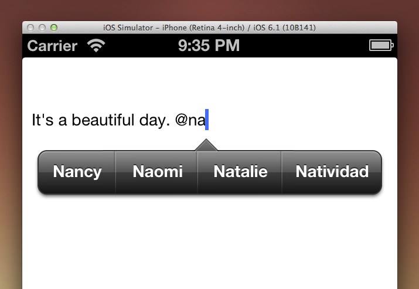

#WUTextSuggestion

A text suggestion toolkit for iOS.



##What can it do?

`WUTextSuggestion` is still early in development, it supports **@ (at)** and ** # (hashtag, twitter style)** suggestions for `UITextView` currently.

------

`WUTextSuggestion` aims to be a full featured text suggestion toolkit for iOS. 

It can easily be integrate it in your project with only couple lines of code.

It allows you to load text suggestions asynchronously from a remote server.

It is fully customizable. You can design your own text suggestion display controller to work with it.

##What's inside?

`WUTextSuggestion` is consists of two parts.

####WUTextSuggestionController

`WUTextSuggestionController` provides the text searching and checking function. It tells you when and how you should give your user text suggestions.

####WUTextSuggestionDisplayController

`WUTextSuggestionDisplayController`, a text suggestion display controller based on `UIMenuController`. It asks it's `dataSource` for the text suggestions, and display them beautifully on the screen.

##Usage

### A. The simple way, use WUTextSuggestionDisplayController.

Using `WUTextSuggestionDisplayController` to display text suggestions.

1. Setup.

	```
	//Create a WUTextSuggestionDisplayController and assign the dataSource.
	WUTextSuggestionDisplayController *suggestionDisplayController = [[WUTextSuggestionDisplayController alloc] init];
	suggestionDisplayController.dataSource = self;
	
	//Create a WUTextSuggestionController with a textView and the suggestionDisplayController you just created.
	WUTextSuggestionController *suggestionController = [[WUTextSuggestionController alloc] initWithTextView:self.textView suggestionDisplayController:suggestionDisplayController];
	//Set the suggestion type
	suggestionController.suggestionType = WUTextSuggestionTypeAt | WUTextSuggestionTypeHashTag;
	
	```

2. Provide the suggestions.

	```
	//WUTextSuggestionDisplayControllerDataSource
	
	//You need to provide the text suggestions based on the suggestionType and suggestionQuery.
	//When a user typed "@na", the suggestionType will be WUTextSuggestionTypeAt, and the suggestionQuery will be "na".
	//You need to wrap the suggestions into WUTextSuggestionItem object, return an array of WUTextSuggestionItem.
	
	- (NSArray *)textSuggestionDisplayController:(WUTextSuggestionDisplayController *)textSuggestionDisplayController suggestionDisplayItemsForSuggestionType:(WUTextSuggestionType)suggestionType query:(NSString *)suggestionQuery
	{
		//return an array of WUTextSuggestionItem.
	}
	
	//You can also use the -textSuggestionDisplayController:suggestionDisplayItemsForSuggestionType:query:callback: for async data loading.		
	```
	
	A `WUTextSuggestionItem` has a `title` and a `customActionBlock`. 
	
	`title` is the suggesting text. 
	
	`customActionBlock`, if assigned, will be executed after user tapped that text suggestion.
	
3. Done. **There's a demo project `WUTextSuggestionDemo`**.

### B. Working with your custom text suggestion display controller.

1. You need to use `- initWithTextView:` to create an instance of `WUTextSuggestionController`. 

2. The `textView` will hold a strong pointer to the `textSuggestionController` which can be acquired using `textSuggestionController` property of the `textView`.

3. Set the `suggestionType` property of the `textSuggestionController`.

4. Listen to the callback and present your custom text suggestion view.


```
//1.
WUTextSuggestionController *suggestionController = [[WUTextSuggestionController alloc] initWithTextView:self.textView];

//3.
suggestionController.suggestionType = WUTextSuggestionTypeAt | WUTextSuggestionTypeHashTag;

//4.
[suggestionController setShouldBeginSuggestingBlock:^{
	//"@" or "#" detected. 	You should prepare your text suggestion view.
}];
[suggestionController setShouldReloadSuggestionsBlock:^(WUTextSuggestionType type, NSString *query, NSRange range) {
	//User typed something after the "@" or "#", you should show your text suggestion view with suggestions.
}];
[suggestionController setShouldEndSuggestingBlock:^{
	//Suggesting end. You should hide your text suggestion view.
}];

```

##Roadmap

- UITextField support.

##Requirements

- Automatic Reference Counting (ARC)
- iOS 5.0+
- Xcode 4.5+

##Contributing

If you find a bug and know exactly how to fix it, please open a pull request.

If you can't make the change yourself, please open an issue after making sure that one isn't already logged.

##License

The MIT license, as aways.